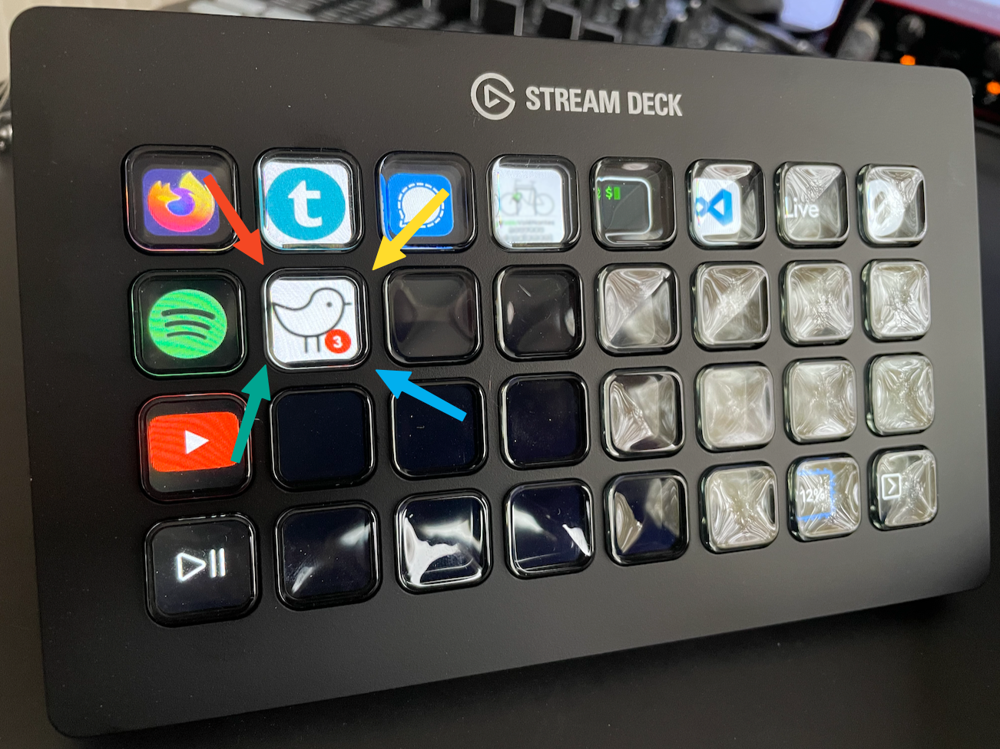
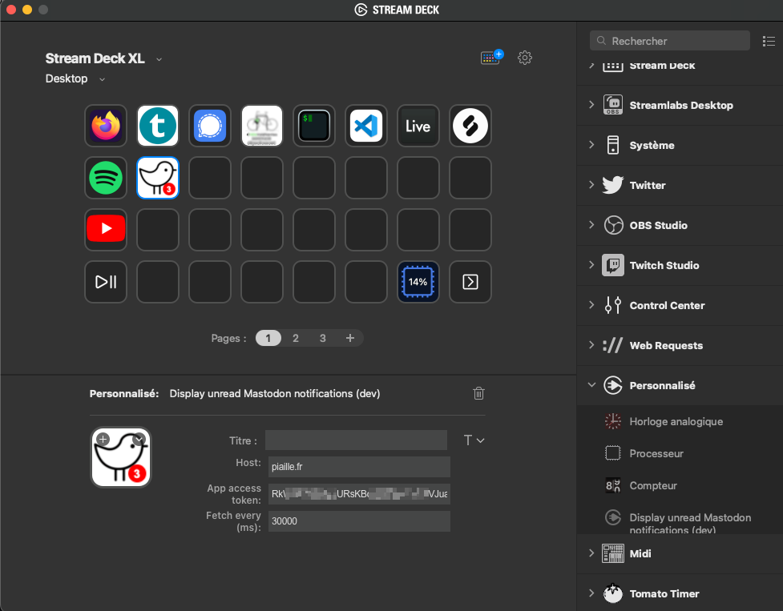

# Mastodon Unread Notifications Displayer

This simple StreamDeck plugin aims to display the number of unread notifications for your Mastodon account.




## Build dev
```
npm run build
```
## Package dev
```
npm run package
```

## Create an app access token from your instance
* Go to your instance application developpement settings and create a new application -> ex: https://mastodon.social/settings/applications/new
* Chose a name for it then make sure you have selected the following Oauth scope attributes:
```
read:notifications
read:statuses
```

## Enable logging on filesystem
https://developer.elgato.com/documentation/stream-deck/sdk/create-your-own-plugin/#debugging

Be careful with activating it, I made it verbose...

### On Mac
```
defaults write com.elgato.StreamDeck html_remote_debugging_enabled -bool YES
```

### On Windows
You will need to add a `DWORD html_remote_debugging_enabled` with value `1` in the registry `@ HKEY_CURRENT_USER\Software\Elgato Systems GmbH\StreamDeck`.

## TODO 
* [ ] Stop listening on every letter typed in app config, add debouncing..
* [ ] Create proper icon for the plugin instead of pink background..
* [ ] Add debug mode on plugin properties